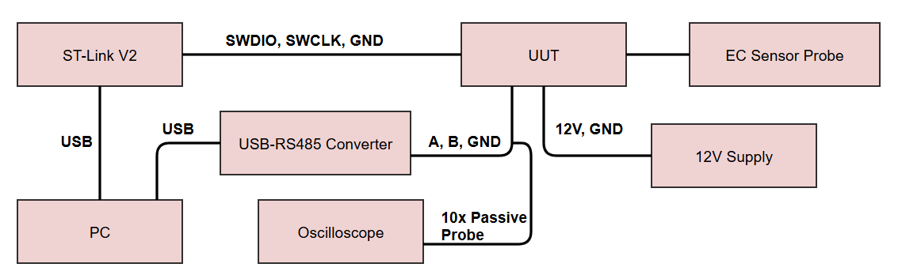
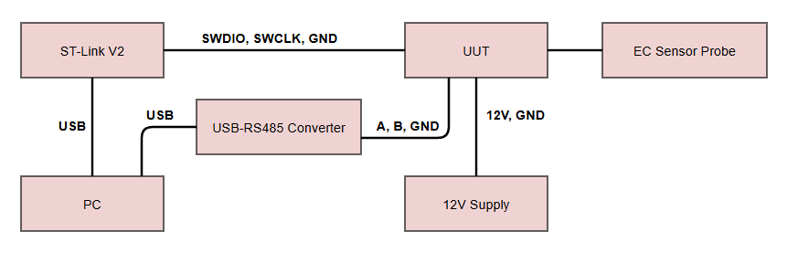

# Hardware Bring‑Up Test Plan & Procedures  
**Document ID:** TDS-DTP-001  
**Revision:** 1.0  
**Author:** Jairo Huaylinos  
**Date:** 2026‑09‑12  

---

# Table of Contents
1. Introduction  
2. Unit Under Test  
3. Equipment Required  
4. Test Plan Overview  
5. Test Procedures  
   - 5.1 ST‑Link Power‑Up & Blink 
   - 5.2 External 12 V Power‑Up  & Blink
   - 5.3 RS‑485 Modbus Communication  
   - 5.4 Analog Front End + ADC Verification  

---

# 1. Introduction
This document defines the Modbus over RS-485 half duplex Signal Integrity (SI) testing for the All-In-One STM32‑based Total Dissolved Solids (TDS) sensor PCB. It outlines the Unit Under Test (UUT), required test equipment, describes the test stages, and provides step‑by‑step procedures with clear success criteria.

Goal: Verify reliable Modbus RTU communication over RS‑485 half‑duplex on the prototype PCB.
Scope: Protocol‑level timing and error‑free communication. Along with basic RS‑485 electrical sanity checks.

Regulatory and formal RS‑485 electrical and commercial industrial compliance (TIA‑485, FCC Part 15, UL 61010‑1, IEC 61326‑1) are out of scope for this prototype phase. Furthermore, the TIA‑485‑A standard does not specify rise time, fall time, or jitter requirements for RS‑485 drivers.

---

# 2. Unit Under Test (UUT)

The UUT is a custom STM32‑based TDS sensor PCB, serial number 2, paired with an electrical conductivity (EC) sensor probe. The board uses an STM32F103C8T6 microcontroller with a user LED on PC13 and includes an onboard RS‑485 transceiver (PN MAX485CUA+T) for the electrical interface for Modbus protocol communication. The analog front end is an AC‑excitation EC measurement circuit designed to output a DC voltage based on the conductivity through the external EC probe. Power is supplied through a 12 V input and regulated down to 5 V, 3.3 V, 3 V, and −3 V rails.

---

# 3. Equipment Required

| Name | Part Number | Description |
|------|-------------|-------------|
|  |  |  |
|  |  |  |
|  |  |  |
|  |  |  |
|  |  |  |
|  |  |  |
|  |  |  |
|  |  |  |
|  |  |  |
|  |  |  |

---

# 4. Test Plan Overview

The hardware bring‑up consists of four main stages:

1. **Packet transmission**  
   Verifies MCU boot, clock operation, GPIO functionality, and basic power behavior using the debugger’s 3.3 V supply.

2. **Signal Rise & Fall Times**  
   The manufacturer for the MAX485CUA+T characterizes drive rise and fall times (tR, tF) as (MIN: 3ns, TYP: 15ns, MAX: 40ns) and maximum data rate fMAX as 2.5 Mbps.

Each stage includes structured procedures with defined success criteria.

Modbus communication at different baud rates. Capture log. Use representative cable lengths.

Notes for what the test should include:
   - that the device responds to both broadcast and unicast requests from the master. (Using both Even parity (required) and no parity (recommended))
   - 3.5 character spacing betweem message frames
   - try sending modbbus frames at the maximum size of 256 bytes
   - slave transmit messsage frame shoud have less than 1.5 char time spacing between 2 characters. Verify this.
   - Does my modbus slave driver code include interrupts for t1.5 and t3.5? does it monitor this? Consequently these two timers must be strictly respected when the baud rate is equal or lower than 19200 Bps
   - Typical buad rate for RS485 is 9600. 9600 bps and 19.2 Kbps are required. Must test these 2 baud rates, also test a lower baud rate of 1200. There is no minimum but this is the typical minimum baud rate in modern systems.
   - Transmit baud rate accuracy must be within 1%. Reception baud rate tolerance: must accept up to 2% error. Not sure how you'd test the reception tolerance. Where does this 1% requirement come?
  

Ok so test goals (hardware centric only)
- Device can recieve and transmit at 9600 bps, 19200 bps, and 1200 bps.
- Device RTU message frames must be transmitted with less than 1.5 character times spacing.
- Device transmission baud rate accuracy is within 1%.
- RS-485 voltage levels are correct.
- Less than 200mV magnitude difference between RS485 A-B vs B-A signal.

Even parity testing is not necessary here, goal is hardware centric.

1.5 character spacing: 1 character is defined as one full UART frame. 1 character is 11 bits (1 start bit, 8 bits for data, 1 parity bit, and 1 stop bit).

Out of scope:
- Recepetion baud rate tolerance of up to 2%. -> do not have tools to test this. this is more of a software capability.
- Response to both unicast and broadcast messages.
- 

---

# 5. Test Procedures

---

## 5.1 ST‑Link Power‑Up Procedure

  
   
  <em>Figure 1: RS485 SI Test Setup</em>

&nbsp;

| Step # | Description | Success Criteria | P/F |
|--------|-------------|------------------|-----|
| 1 |  |  |  |
| 2 |  |  |  |
| 3 |  |  |  |
| 4 |  |  |  |
| 5 |  |  |  |
| 6 |  |  |  |
| 7 |  |  |  |
| 8 |  |  |  |
| 9 |  |  |  |
| 10 |  |  |  |
| 11 |  |  |  |
| 12 |  |  |  |
| 13 |  |  |  |
| 14 |  |  |  |
| 15 |  |  |  |
| 16 |  |  |  |
| 17 |  |  |  |
| 18 |  |  |  |
| 19 |  |  |  |
| 20 |  |  |  |
| 21 |  |  |  |
| 22 |  |  |  |
| 23 |  |  |  |
| 24 |  |  |  |
| 25 |  |  |  |
| 26 |  |  |  |
| 27 |  |  |  |
| 28 |  |  |  |

### Notes

---

## 5.4 Analog Front End + ADC Verification Procedure

  
   
  <em>Figure 4: Analog Front End + ADC Verification Test Setup</em>

&nbsp;

| Step # | Description | Success Criteria | P/F |
|--------|-------------|------------------|-----|
| 1 |  |  |  |
| 2 |  |  |  |
| 3 |  |  |  |
| 4 |  |  |  |
| 5 |  |  |  |
| 6 |  |  |  |
| 7 |  |  |  |
| 8 |  |  |  |
| 9 |  |  |  |
| 10 |  |  |  |
| 11 |  |  |  |
| 12 |  |  |  |

### Notes

---

# 6. References
