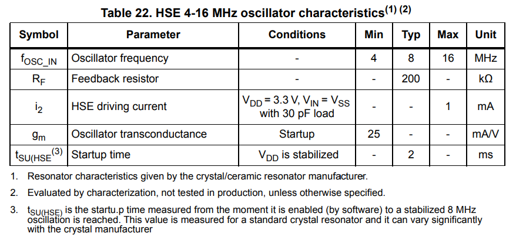
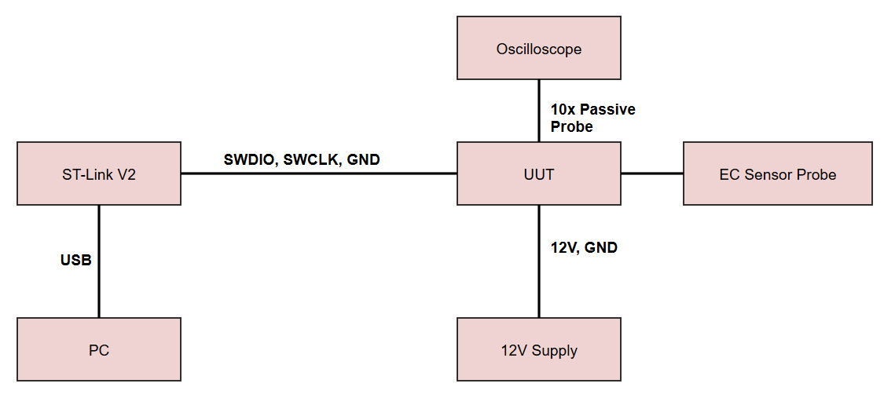

# HSE Characterization Test Plan & Procedures  
**Document ID:** TDS-DTP-003  
**Revision:** 1.0  
**Author:** Jairo Huaylinos  
**Date:** 2026‑10-03 

---

# Table of Contents
1. Introduction  
2. Unit Under Test  
3. Equipment Required  
4. Test Procedures  
   - 4.1  

---

# 1. Introduction
This document defines the High Speed External Crystal (HSE) Oscillator characterization testing for the All-In-One STM32‑based Total Dissolved Solids (TDS) sensor PCB. It outlines the Unit Under Test (UUT), required test equipment, describes the test stages, and provides step‑by‑step procedures with clear success criteria.

Goal: Verify that the HSE crystal oscillator oscillates at 8MHz.
Scope: The signal integrity test covers 8 MHz High‑Speed External (HSE) crystal oscillator on the STM32‑based TDS sensor PCB. It verifies that the HSE oscillator:
   - Starts reliably under nominal operating conditions
   - Oscillates at the correct frequency within the specified tolerance

The scope is limited to bench‑level frequency characterization of the HSE oscillator on the prototype PCB and does not include EMC, safety, or long‑term reliability testing. Startup time measurement is out of scope due to lack of lab equipment.

  
   
  <em>Figure 1: STM32F103 Datasheet HSE crystal oscillator characteristics</em>

&nbsp;

---

# 2. Unit Under Test (UUT)

The UUT is a custom STM32‑based TDS sensor PCB, serial number 2, paired with an electrical conductivity (EC) sensor probe. The board uses an STM32F103C8T6 microcontroller with a user LED on PC13 and includes an onboard RS‑485 transceiver (PN MAX485CUA+T) for the electrical interface for Modbus protocol communication. The analog front end is an AC‑excitation EC measurement circuit designed to output a DC voltage based on the conductivity through the external EC probe. Power is supplied through a 12 V input and regulated down to 5 V, 3.3 V, 3 V, and −3 V rails.

---

# 3. Equipment Required

| Name | Part Number | Description |
|------|-------------|-------------|
| ST‑Link Programmer | ST‑LINK/V2 | SWD programmer/debugger with 3.3 V supply |
| Personal Computer | N/A | Any Desktop PC or laptop |
| 12V Power Supply | N/A | 12 V DC Wall Adapter with modified leads |
| Oscilloscope | SDS 1202X-E | Siglent 200 MHz 1Gsa/s Digital Storage Oscilloscope |
| Digital Multimeter | DM6000AR | AstroAI True-RMS DMM, 6000 Counts |
| Blink Firmware | N/A | Toggles PC13 LED for basic MCU verification |
| Modbus Dummy Slave Firmware | N/A | Sends fixed Modbus FC04 response frames for RS‑485 validation |
| ADC + Modbus Firmware | N/A | Reads ADC and reports voltage via Modbus |
| ModbusTool SW |  N/A | Modbus Master tool to poll UUT. https://github.com/ClassicDIY/ModbusTool.git |
| USB - RS485 Converter | N/A | CERRXIAN 1FT RS485 to USB Terminal Converter Serial Port Cable |

---

# 4. Test Procedures

---

## 4.1 HSE Characteristics Test Procedure

  
   
  <em>Figure 2: HSE clock testing setup</em>

&nbsp;

| Step # | Description | Success Criteria | P/F |
|--------|-------------|------------------|-----|
| 1      | Configure pin 29 as the MCO output for the HSE crystal oscillator and setup a basic LED blink program with a 1Hz frequency | Pin 29 is no longer configured as the RS485 enable signal and instead is configured as MCO Output for the HSE oscillator |  |
| 2 | Connect the oscilloscope probe to the pin 29 on the STM32F108C8T6 IC1 | Probe is connected to pin 29 with appropriate ground reference |  |
| 3 | Connect ST-Link SWCLK, SWDIO, and GND pins to the UUT on connector J2. Disconnect 3.3V pin | Board remains unpowered until 12V is applied |  |
| 4 | Connect the 12V Power Supply power and ground to connector J4 on the UUT | Power supply power and ground is physically connected to J4 pin 1 (P_IN) and pin 4 (GND) |  |
| 5 | Flash the board with the new code (use a release build, not debug build). | Release build is successfully flashed to the board with no errors |  |
| 6 | Set oscilloscope to 500mV/Div, trigger level to 1.5V. | Oscilloscope is setup with these settings |  |
| 7 | Measure the oscillator frequency | Oscillator frequency is 8MHz +- 1% |  |
| 8 | Observe LED D2 | LED D2 is blinking at a rate of 1 Hz |  |

### Notes

---

# 5. References
