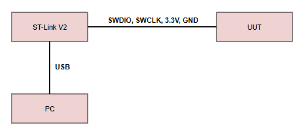
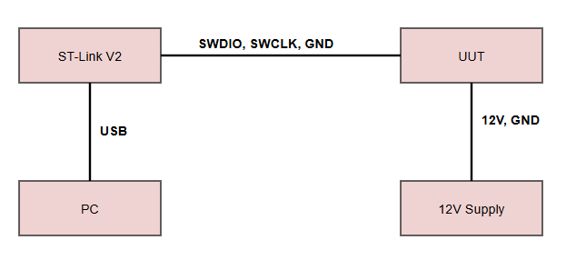
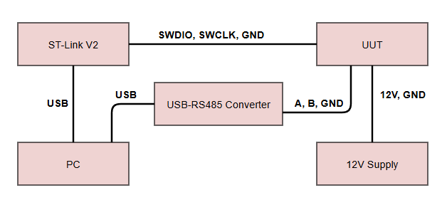
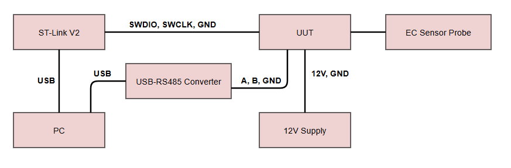

# Hardware Bring‑Up Test Plan & Procedures  
**Document ID:** TDS-DTP-001
**Revision:** 1.0  
**Author:** Jairo Huaylinos
**Date:** 2026‑09‑12  

---

# Table of Contents
1. Introduction  
2. Unit Under Test  
3. Equipment Required  
4. Test Plan Overview  
5. Test Procedures  
   - 5.1 ST‑Link Power‑Up & Blink 
   - 5.2 External 12 V Power‑Up  & Blink
   - 5.3 RS‑485 Modbus Communication  
   - 5.4 Analog Front End + ADC Verification  

---

# 1. Introduction
This document defines the hardware bring‑up plan and procedures for the All-In-One STM32‑based Total Dissolved Solids (TDS) sensor PCB. It outlines the Unit Under Test (UUT), required test equipment, describes the test stages, and provides step‑by‑step procedures with clear success criteria.

---

# 2. Unit Under Test (UUT)

The UUT is a custom STM32‑based TDS sensor PCB, serial number 2, paired with an electrical conductivity (EC) sensor probe. The board uses an STM32F103C8T6 microcontroller with a user LED on PC13 and includes an onboard RS‑485 transceiver (PN MAX485CUA+T) for the electrical interface for Modbus protocol communication. The analog front end is an AC‑excitation EC measurement circuit designed to output a DC voltage based on the conductivity through the external EC probe. Power is supplied through a 12 V input and regulated down to 5 V, 3.3 V, 3 V, and −3 V rails. This bring‑up verifies that the MCU initializes correctly, the power rails are stable, the RS‑485 interface communicates reliably, and the analog front end produces valid ADC readings.

---

# 3. Equipment Required

| Name | Part Number | Description |
|------|-------------|-------------|
| ST‑Link Programmer | ST‑LINK/V2 | SWD programmer/debugger with 3.3 V supply |
| Personal Computer | N/A | Any Desktop PC or laptop |
| 12V Power Supply | N/A | 12 V DC Wall Adapter with modified leads |
| Oscilloscope | SDS 1202X-E | Siglent 200 MHz 1Gsa/s Digital Storage Oscilloscope |
| Digital Multimeter | DM6000AR | AstroAI True-RMS DMM, 6000 Counts |
| Blink Firmware | N/A | Toggles PC13 LED for basic MCU verification |
| Modbus Dummy Slave Firmware | N/A | Sends fixed Modbus FC04 response frames for RS‑485 validation |
| ADC + Modbus Firmware | N/A | Reads ADC and reports voltage via Modbus |
| ModbusTool SW |  N/A | Modbus Master tool to poll UUT. https://github.com/ClassicDIY/ModbusTool.git |
| USB - RS485 Converter | N/A | CERRXIAN 1FT RS485 to USB Terminal Converter Serial Port Cable |

---

# 4. Test Plan Overview

The hardware bring‑up consists of four main stages:

1. **ST‑Link Power‑Up & Blink**  
   Verifies MCU boot, clock operation, GPIO functionality, and basic power behavior using the debugger’s 3.3 V supply.

2. **External 12 V Power‑Up & Blink**  
   Validates the full power chain (12 V ⇒ 5 V ⇒ 3.3 V ⇒ 3V ⇒ -3V) and confirms the board operates correctly from its intended supply.

3. **RS‑485 Modbus Communication**  
   Confirms UART configuration, RS‑485 transceiver operation, and basic Modbus frame reception and transmission.

4. **Analog Front End + ADC Verification**  
   Checks the analog signal path, ADC conversion accuracy, and Modbus‑reported voltage values.

Each stage includes structured procedures with defined success criteria.

---

# 5. Test Procedures

---

## 5.1 ST‑Link Power‑Up Procedure

<figure style="text-align: center;">
  
  <figcaption>Figure 1: ST-Link Power-Up Test Setup</figcaption>
</figure>

 

| Step # | Description | Success Criteria | P/F |
|--------|-------------|------------------|-----|
| 1 | Connect ST‑Link SWCLK, SWDIO 3.3 V, and GND pins to the UUT on connector J2| ST‑Link connects to MCU without errors |  |
| 2 | Measure 3.3V rail with DMM at C4 | Voltage is within 3.2–3.4V |  |
| 3 | Measure 3V rail with DMM at C18 | Voltage is within 2.9–3.1V |  |
| 4 | Measure -3V rail with DMM at C20 | Voltage is within (-3.1)–(-2.9)V |  |
| 5 | Flash blink firmware (PC13 LED) | Firmware loads successfully |  |
| 6 | Observe PC13 LED | LED blinks at a rate of approx. 0.5s |  |

### Notes

---

## 5.2 External 12 V Power‑Up Procedure

<figure style="text-align: center;">
  
  <figcaption>Figure 1: External 12V Power-Up Test Setup</figcaption>
</figure>

 

| Step # | Description | Success Criteria | P/F |
|--------|-------------|------------------|-----|
| 1 | Connect ST-Link SWCLK, SWDIO, and GND pins to the UUT on connector J2. Disconnect 3.3V pin | Board remains unpowered until 12V is applied |  |
| 2 | Connect the 12V Power Supply power and ground to connector J4 on the UUT| Power supply power and ground is physically connected to J4 pin 1 (P_IN) and pin 4 (GND)|  |
| 3 | Measure 12V rail with the DMM | Voltage is within 11.9-12.1V |  |
| 4 | Measure 5V rail with the DMM| Votlage is within 4.9–5.1V |  |
| 5 | Measure 3.3V rail with the DMM| Voltage is within 3.2–3.4V |  |
| 6 | Measure 3V rail with DMM at C18 | Voltage is within 2.9–3.1V |  |
| 7 | Measure -3V rail with DMM at C20 | Voltage is within (-3.1)–(-2.9)V |  |
| 8 | Observe PC13 LED | LED blinks at a rate of approx 0.5s |
| 9 | Flash blink firmware (PC13 LED) | Firmware loads successfully |  |
| 10 | Observe PC13 LED | LED blinks at a rate of approx. 0.5s |  |

### Notes

---

## 5.3 RS‑485 Modbus Communication Procedure

<figure style="text-align: center;">
  
  <figcaption>Figure 1: External 12V Power-Up Test Setup</figcaption>
</figure>

 

| Step # | Description | Success Criteria | P/F |
|--------|-------------|------------------|-----|
| 1 | Connect ST-Link SWCLK, SWDIO, and GND pins to the UUT on connector J2. Do not conect the 3.3V pin | Board remains unpowered until 12V is applied |  |
| 2 | Connect the USB-RS485 Converter A, B, and GND rails to the UUT on connector J4. Connect the USB interface end to your PC. | Board remains unpowered until 12V is applied |  |
| 3 | Connect the 12V Power Supply power and ground to connector J4 on the UUT| Power supply power and ground is physically connected to J4 pin 1 (P_IN) and pin 4 (GND)|  |
| 4 | Flash Modbus dummy slave RX/TX firmware | Firmware loads successfully |  |
| 5 | Open the Modbus Master SW tool on your PC. Connect to the corresponding COM port with Baud=9600, Parity = None, Data Bits = 8, and Stop Bits = 1, Slave ID = 1. These settings should match you UART settings on the UUT's MCU. | Log shows "Connected using RTU to COMX", Stable connection. |  |
| 6 | Select "read input register" in functions and set Poll to 1000 and check the box to activate polling. Set Start Address to 0. Set Size to 1. Click Apply button| Log shows "Read succeeded: Function Code: 4." |  |
| 7 | Monitor Modbus TX and RX frames on the Log| Log shows "TX: 01 04 00 00 00 01 31 ca" and "RX: 01 04 02 XX XX XX XX" |  |
| 8 | Verify RX payload and CRC | For example, if the UUT's input register at address 1 is set to 2, then the log should show "RX: 01 04 02 00 02 38 f1". If you have a different payload configured validate the correct payload and CRC bytes using https://valtoris.com/tools/modbus-rtu-crc-16-calculator-hex-checksum-debugging-tool/?hex=11%2004%2002%2000%200A |  |

### Notes

---

## 5.4 Analog Front End + ADC Verification Procedure

<figure style="text-align: center;">
  
  <figcaption>Figure 1: External 12V Power-Up Test Setup</figcaption>
</figure>

 

| Step # | Description | Success Criteria | P/F |
|--------|-------------|------------------|-----|
| 1 | Connect ST-Link SWCLK, SWDIO, and GND pins to the UUT on connector J2. Do not conect the 3.3V pin | Board remains unpowered until 12V is applied |  |
| 2 | Connect the USB-RS485 Converter A, B, and GND rails to the UUT on connector J4. Connect the USB interface end to your PC. | Board remains unpowered until 12V is applied |  |
| 1 | Connect  the EC sensor probe to connector J3 on the UUT | EC sensor probe is connected to the UUT |  |
| 3 | Connect the 12V Power Supply power and ground to connector J4 on the UUT| Power supply power and ground is physically connected to J4 pin 1 (P_IN) and pin 4 (GND)|  |
| 4 | Measure the 3.3V supply voltage with the DMM at C6 (close to the MCU) and record it (Vin). | 3.2V-3.4V is measured and recorded | |
| 5 | Calculate the ADC to Voltage conversion factor using K = 104 x 4095/Vin | Conversion factor is about equal to the ideal conversion factor of 104 x 3.3V/4095 = 8.0586 |  |
| 1 | Update the ADC + Modbus Firmware with your conversion factor in: `v_reading = sensor_reading * 8.105f;` | Firmware builds with no errors |  | 
| 1 | Flash ADC + Modbus firmware | Firmware loads successfully |  |
| 2 | Measure ADC input voltage with DMM at D8 and record it.| Stable reading; no unexpected fluctuations |  |
| 3 | Read Modbus‑reported voltage (represented in hex value, with decimal converter number in units of 10-4 V) | Log shows "RX: 01 04 02 XX XX YY YY", with XX XX being the voltage value. |  |
| 4 | Compare DMM vs Modbus values | Values are reasonably close (pre‑calibration tolerance) |  |

### Notes

---

# 6. References
