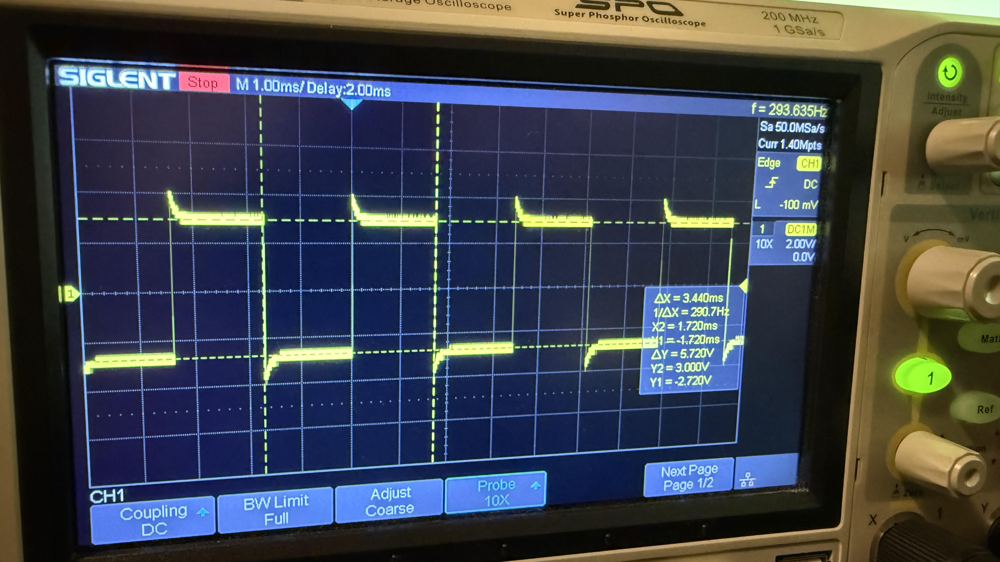
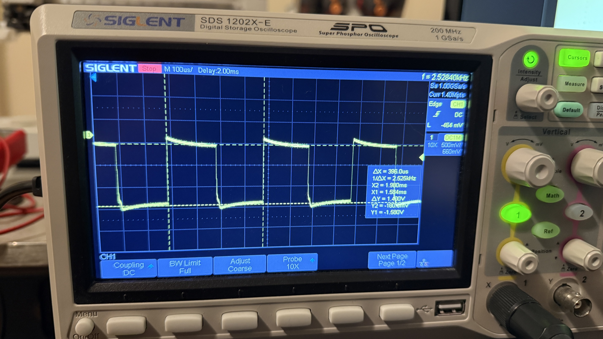
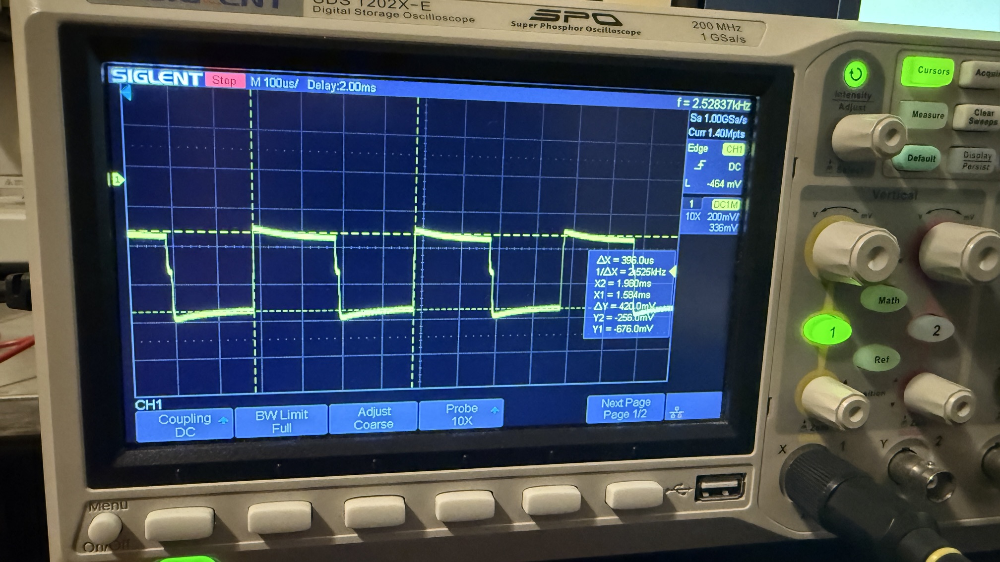
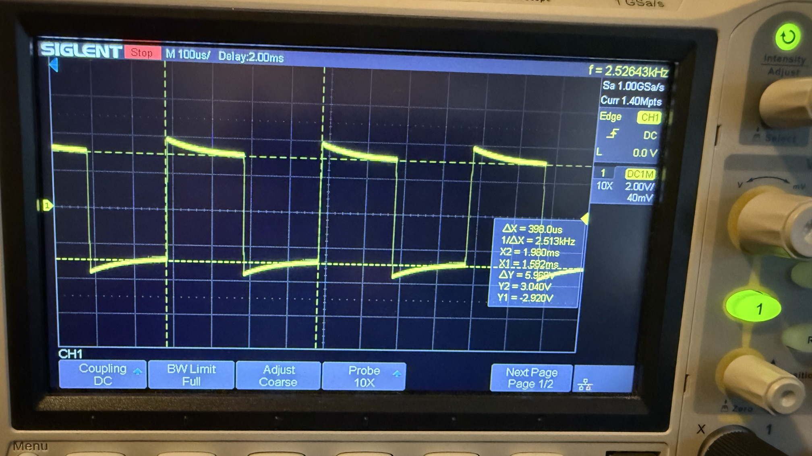
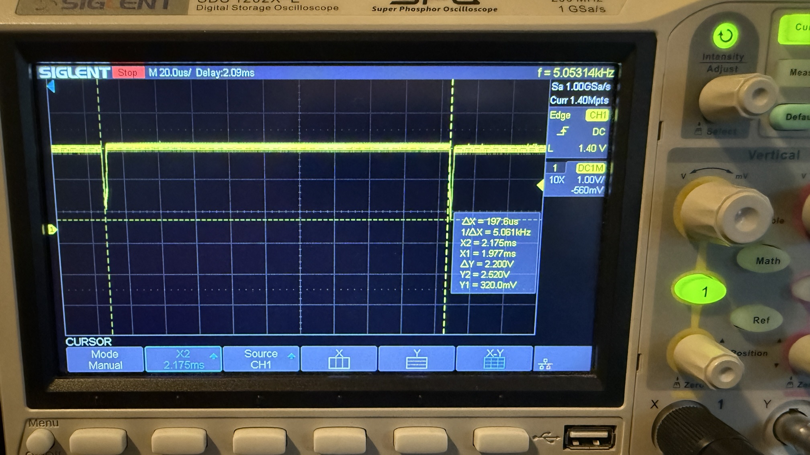
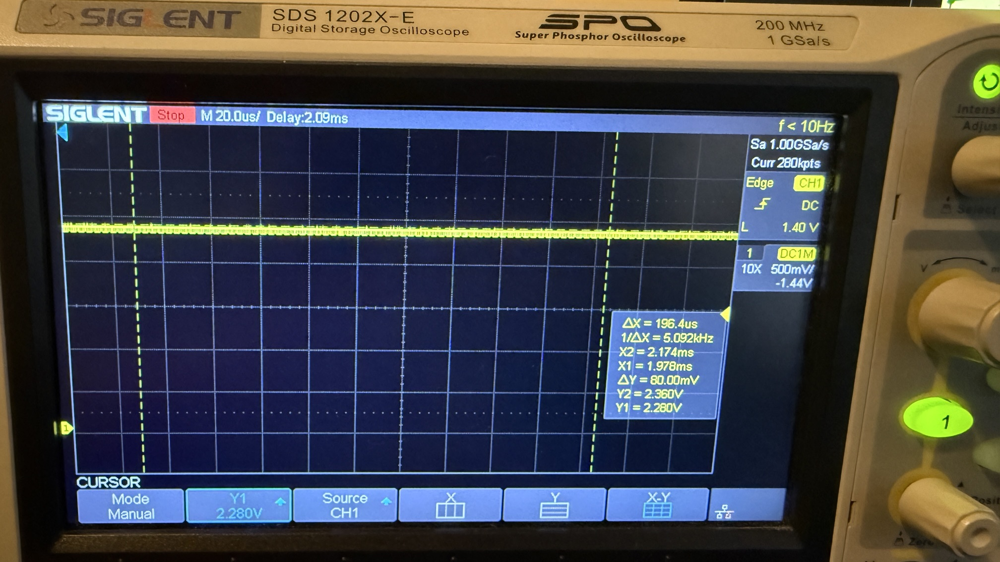

# AFE and ADC Verification Root Cause Analysis (RCA)
## AFE Failure During Hardware Bring-Up  
**Author:** Jairo Huaylinos
**Date:** 2026-09-21
**Board:** Custom STM32-Based TDS Sensor PCB  

---

## 1. Overview
During the AFE & ADC Verification stage of the TDS Sensor PCB HW bring-up, the AFE output voltage / ADC input voltage reading was measured to be -220mV while the EC sensor probe was submersed in room temperature tap water. Under normal operation, the AFE should never output a negative voltage. The AFE is intended to produce a voltage in the range of 0-3.3V.

This Root Cause Analysis uses a **Fishbone (Ishikawa) Methodology** to identify contributing factors across design, components, process, tools, and testing.

---

## 2. Problem Statement
The board's AFE outputs -220mV when the EC sensor probe is submersed in room temperature tap water and the modbus reported ADC voltage is 0V. Symptoms included:

- Incorrect ADC voltage reporting. 

The failure could originate from the MCU, oscillation generation stage, probe itself, amplification stage, rectification stage.

---

## 3. Fishbone (Ishikawa) Analysis

### 3.1 Categories Considered
- **Design**
- **Components**
- **Manufacturing / Assembly**
- **Tools / EDA**
- **Testing / Process**
- **Environment**

---

### 3.2 Fishbone Breakdown

#### **Design**
- Incorrect routing of AFE components.

#### **Components**
- Faulty AFE ICs (IC2: CD4060BM and IC3: LMV324AQDYYRQ1).
- Faulty AFE passive components.
- Faulty ADC on the STM32F103C8T6 MCU.
- Faulty EC Sensor Probe.

#### **Manufacturing / Assembly**
- Short circuit caused by solder bridges or tin whiskering between AFE IC pins or passives.
- Disconnected IC pins due to missing/insufficient solder, cold joints, or damaged pads. 
- Tombstoned components.
- Broken SMD package pins during assembly.

#### **Tools**
- Firmware bug forcing a 0V ADC reading.

#### **Testing / Process**

#### **Environment**
- Dust creating short circuit conditions.

---

## 4. Diagnostic Process Summary
### Step 1 — Verify AFE and sensor probe responsiveness
- Measured AFE output and voltage difference between the two EC probe wires when the EC probe was submerged in high‑concentration salt water and when the EC probe was in air.  
- AFE output changed from about -220 mV (submerged) to about -80 mV (in air), confirming the AFE responds to probe conditions.
- Observed a large voltage difference in air and near 0 V difference in high‑concentration salt water, confirming the EC probe is functional and not the root cause.  
- Conclusion: **AFE and EC probe are responsive; probe failure is not the root cause.**

### Step 2 — Visual inspection and contamination removal
- Board had been sitting uncovered on the bench and accumulated dust and particulate debris.
- Executed a visual inspection and found string‑like dust particles and tin whiskers on the board.
- Removed dust with compressed air and tweezers. Removed all tin whiskers on the AFE circuitry via mechanical removal and by reflow with a soldering iron.
- Re‑measured AFE output after cleaning: **-220 mV persisted. Short circuits due to tin whiskering and dust are not the root cause.**

### Step 3 — Oscillator generator diagnosis and RC timing network correction
- Probed the oscillator output at pin 7 of IC2 and observed a square wave with correct amplitude limits (+3V to -3V), and a measured frequency of 290.1 Hz. One magnitude off from the design target of 2.84 kHz.

  

  <em>Figure 1: Oscillator Output at IC2 Pin 7, 290Hz</em>

- Suspected fault in the oscillators external RC timing network. So, verified that the SMD resistor package values match the schematic. Found that the correct resistors were used per design.
- Suspect a faulty RC smd component. So, measured resistances and capacitance with a DMM: R4 ≈ 100 kΩ, R5 ≈ 100 kΩ. Measured C25 ≈ 1 nF.
- Measured continuity of the RC network and found it matched the schematic design.
- Suspect design error in the external RC timing network. Calculated expected frequency from the datasheet and discovered R5 should be 10 kΩ, not 100 kΩ, to achieve 2.84 kHz.  
- Replaced R5 with a 10 kΩ resistor and verified the oscillator produced the expected output frequency and voltages. See Figure 2.
- Observation: **Fixing the oscillator frequency did not resolve the -220 mV AFE output issue.**

  

  <em>Figure 2: Oscillator Output at IC2 Pin 7 after R5 swap to 10kΩ</em>

### Step 4 — Probe amplifier stages and identify clipping
- Probed outputs of Op Amp A and Op Amp C in the AFE chain.  
- Observed Op Amp A square wave that swung from -180mV to-1.580V; the positive portion of the waveform was missing.
- Observed Op Amp C square wave that swung from -256mV to -676mV; the positive portion of the waveform was missing.
- Interpreted the waveform as positive‑side clipping at the amplifier stages, suggesting the op‑amp positive supply was not present or not connected.
- 

  
  

  <em>Figure 3: Op Amp A output (Left) and Op Amp C Output (Right)</em>

### Step 5 — Power‑rail continuity checks and solder joint inspection
- Performed continuity checks between the 3V rail and the op‑amp IC3 power pin 4, between the -3V rail and the op amp IC power pin 11, and between ground nets and the grounded IC pins (Pins 3, 5, and 10).  
- Found no continuity between the 3V rail and IC pin 4 and unexpected continuity patterns on some pins.
- Visual inspection revealed cold solder joints at IC3 pin 4, 5, 10, and other IC3 pins.

### Step 6 — Reflow soldering and verification
- Reflowed the suspect op‑amp pins by dragging a soldering iron across the pins to ensure proper solder wetting and joint formation.
- Re‑ran continuity checks between IC3 pins and expected nets. continuity matched the schematic design.
- Re‑probed amplifier outputs after reflow: **and observed the negative‑voltage clipping was resolved.**

### Step 7 — Component replacement and final verification
- Despite restored continuity, AFE output did not reach the expected near 3V level when the EC probe was dipped in a high‑concentration salt solution (expected ≈ 3V, actual = 240mV.).  
- Suspected the op‑amp IC had been damaged; replaced the op‑amp with a new, known‑good device.  
- After replacement, observed ADC/AFE output near the expected maximum (measured ~2.4 V) when the EC probe was dipped in the high‑concentration salt solution.  
- Verified proper waveforms and expected signals at each op‑amp stage.

  
  
  

  <em>Figure 4: Post Replacement captures: Op Amp C Output (Left), Rectified Output (Center), ADC Input (Right)</em>

---

## 5. Root Cause
### **Primary Root Cause**
Root cause was the soldering process used for IC3 (the op‑amp). IC3 was originally soldered along with the rest of the components using hot plate reflow. However, the initial reflow produced multiple solder bridges around the IC pins. To remove those bridges, drag soldering was attempted with no success. Then, hot air removal and reinstallation via pretinning was attempted.

During the hot‑air reinstallation, the IC could not be held perfectly stable due to its small package size. As the solder liquified, the IC shifted around on the footprint, resulting in prolonged heating, uneven cooling, and ultimately cold joints on multiple pins—including the 3V power pin and ground pins. 

Summary: **The root cause was an inefficient and unstable manual soldering/rework process on a small‑package IC, leading to cold joints and eventual op‑amp failure.**

### **Secondary Causes**
- Loss of 3V supply to the op-amp due to cold joints.
- Permanent damage to IC3 due to overheating during rework.

---

## 6. Corrective Actions

### Implemented
- Removed IC3 and cleaned the footprint.
- Reflowed all pads and removed excess solder to eliminate bridges.
- Reinstalled IC3 using hot air, ensuring proper solder wetting across all pins.
- Verified continuity between all IC pins and their respective nets (3 V, GND, signal lines).
- Probed op‑amp stages to confirm restored waveform integrity.
- Replaced IC3 with a brand‑new op‑amp after confirming the original device had been damaged during rework.
- Verified correct AFE output (≈2.4 V in high‑salt solution) and proper operation of all amplifier stages.
- Update R5 value on schematic to 10kΩ.

### Recommended Preventive Actions
- Apply solder paste using a solder paste stencil to ensure the adequeate amount of solder is evenly distributed to the IC pads, thus preventing solder bridges.
- If rework is required, anchor one corner pin first with a soldering iron before switching to hot air to prevent IC movement. Also use Kapton tape to prevent IC drift during reflow.
- Consider using a larger IC package, if size constraint allows.
- Limit time exposed to hot air gun (365 C) to less than 8 seconds when the nozzle is close enough that solder melts.

---

## 7. Conclusion
The failure was caused by an unstable and inefficient soldering/rework process on IC3, where movement of the small‑package op‑amp IC during reflow created cold joints on critical power and ground pins. Repeated hot air and soldering rework also thermally damaged the device. These soldering defects led to loss of the 3V rail at the amplifier stages, clipped waveforms, and, consequently, the persistent −220 mV AFE output. Reflowing the pins restored power and ground continuity, and replacing the damaged op‑amp IC3 fully resolved the issue, confirming that improper soldering and excessive rework were the root cause. 

This RCA highlights effective use of systematic isolation via staged signal probing, and disciplined verification against schematic and datasheet expectations to pinpoint and resolve faults introduced during assembly and rework.
