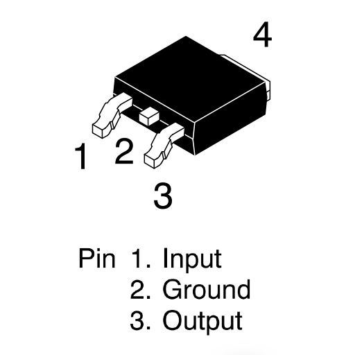
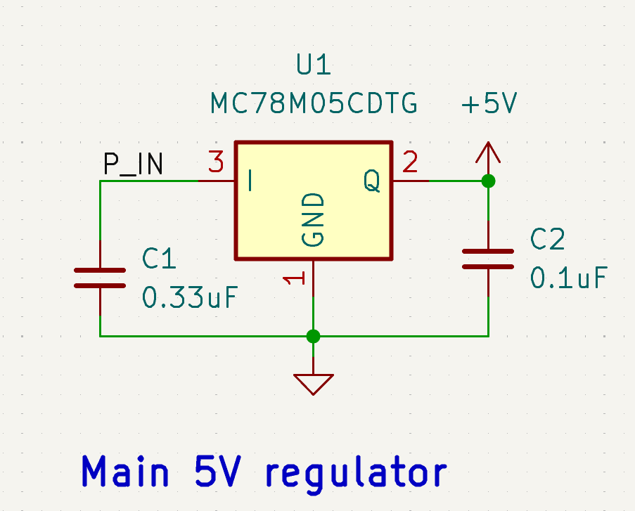
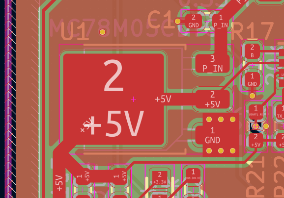
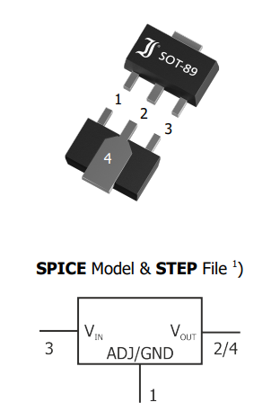
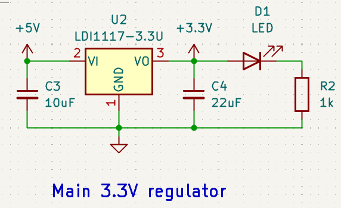
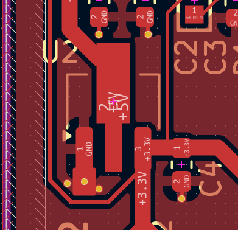
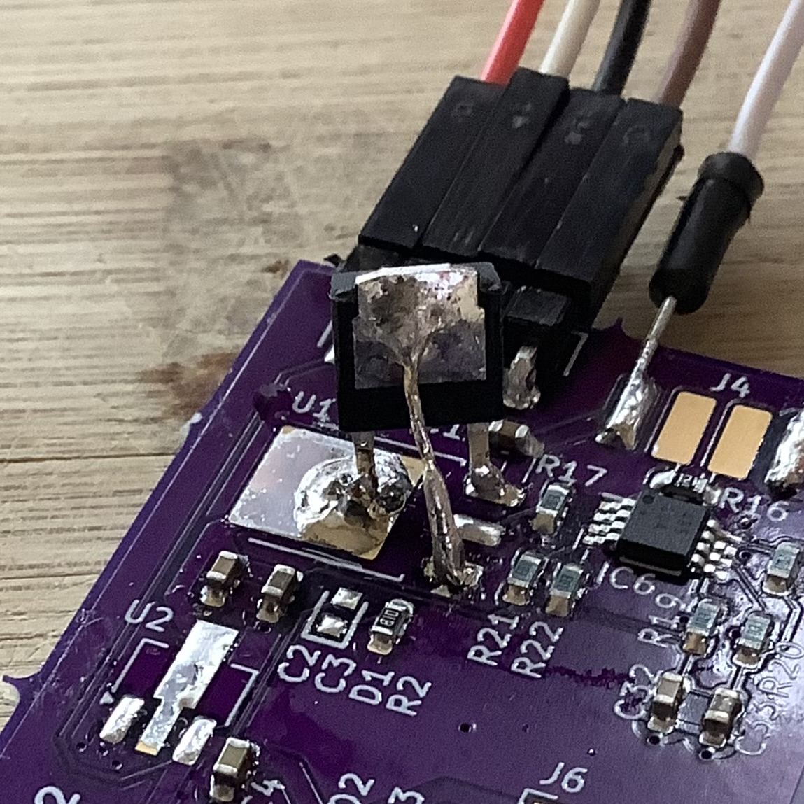
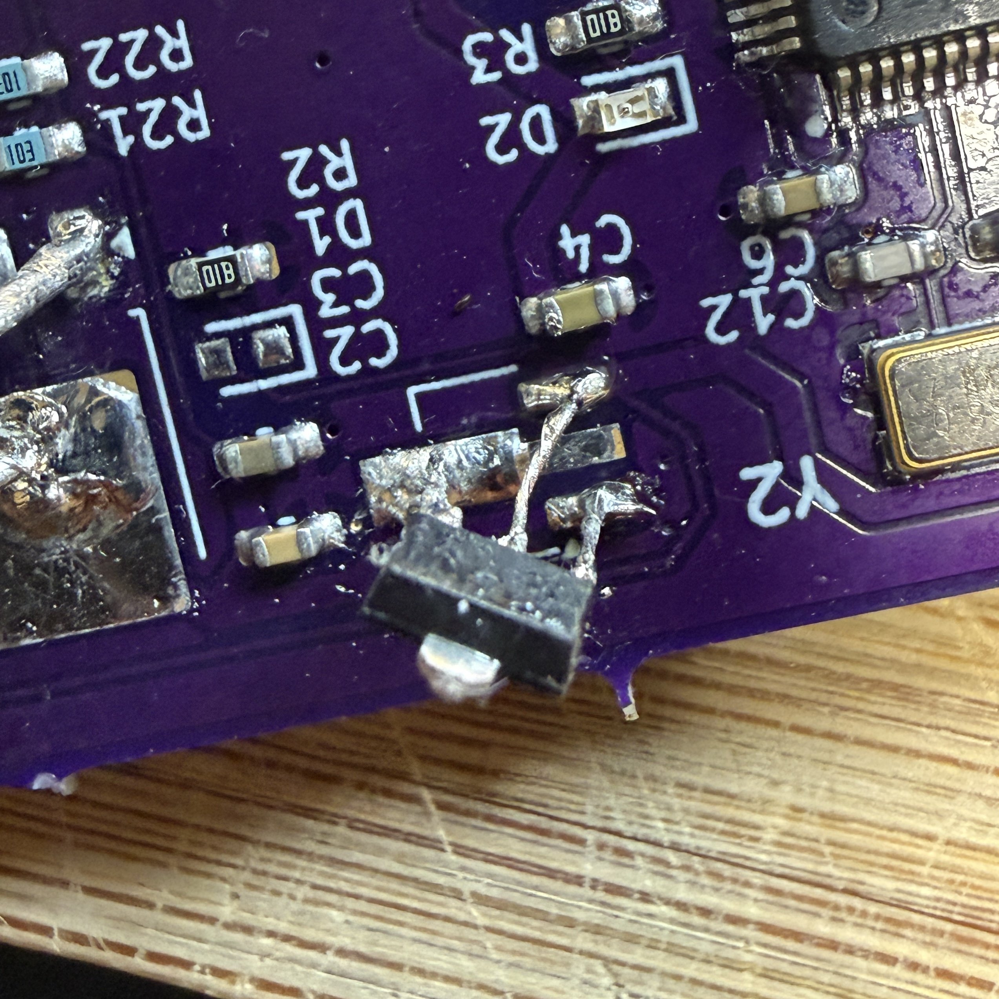

# Root Cause Analysis (RCA)
## Power Regulation Failure During Hardware Bring-Up  
**Author:** Jairo Huaylinos
**Date:** 2026-09-13 
**Board:** Custom STM32-Based TDS Sensor PCB  

---

## 1. Overview
During initial bring-up of the TDS Sensor PCB, the board exhibited severe voltage sag on the 3.3 V rail when powered by the ST-Link Debugger. Both the 5 V and 3.3 V regulators were later found to be incorrectly footprinted, resulting in incorrect pin mapping and regulator malfunction.

This Root Cause Analysis uses a **Fishbone (Ishikawa) Methodology** to identify contributing factors across design, components, process, tools, and testing.

---

## 2. Problem Statement
The board failed to operate correctly under ST‑Link 3.3 V power. Symptoms included:

- Dim PC13 LED blink under ST‑Link power.
- Severe voltage sag on the 3.3 V rail. Measured 2.4V. 

The failure could have originated from any regulator stage or downstream circuitry.

---

## 3. Fishbone (Ishikawa) Analysis

### 3.1 Categories Considered
- **Design**
- **Components**
- **Manufacturing / Assembly**
- **Tools / EDA**
- **Testing / Process**
- **Environment**

---

### 3.2 Fishbone Breakdown

#### **Design**
- Incorrect footprint mapping for 5V, 3.3V, 3V, and/or -3V regulators.
- Incorrect supporting circuitry for the 5V, 3.3V, and/or -3V regulators.
- Short circuit condition.
- Power tree dependency (12V → 5V → 3.3V → ±3V) increased fault propagation risk.
- Incorrect RS-485 circuitry causing short circuit or signficant current draw.

#### **Components**
- Faulty regulators. 
- Faulty bulk and/or decoupling Capacitors resulting in a short circuit.
- Faulty RS-485 IC causing significant current draw.
- Faulty Analog Front End components causing signficant current draw.

#### **Manufacturing / Assembly**
- Short circuit caused by solder bridges or tin whiskering.
- Disconnected regulator pin due to missing/insufficient solder, cold joint, or damaged pads. 
- Tombstoned components.
- Broken SMD package pins during assembly.

#### **Tools**
- Faulty  ST-Link Debugger 3.3V power bus.
- Faulty jumper wires on ST-Link Debugger.

#### **Testing / Process**
- Initial test relied on ST‑Link power, masking upstream regulator failure. 

#### **Environment**
- Dust creating short circuit conditions. 

---

## 4. Diagnostic Process Summary

### Step 1 — Short-Circuit Elimination
- Continuity checks confirmed no shorts between any of the Pin, 5V, 3.3V, 3V, and -3V power and ground nets.
  
### Step 2 — Initial Bring-Up
- 3.3 V rail showed severe sag when powered by the ST-Link V2 Debugger. 
- ST‑Link power produced dim LED blink   
- Attempted to power up using an external 12V power input which resulted in the 5V regulator overheating and no expected 5V output. Measured 5V output with DMM was 200mV.

### Step 3 — Isolation via Desoldering
- 3.3V regulator removed to split power tree to allow independent testing of upstream (5V, RS485) and downstream (±3V, MCU) subsystems.

### Step 4 — Upstream Regulator Testing
- With the 3.3V regulator removed, the 5V regulator was again powered on with the external 12V power supply.
- Identical failure as before: 5V regulator overheated and 5V output was measured at 200mV.
- Suspected faulty regulator, so replaced with a brand new one. Identical failure observed.
- Suspected design/footprint error, verified by comparison between regulator datasheet and schematic/PCB footprints.

  
  
  

  <em>Figure 1: 5V Regulator datasheet pinout vs incorrect design footprint pinouts</em>

&nbsp;

- Conclusion: **Design error: Incorrect schematic and PCB footprints**, not component failure.

### Step 5 — Downstream Regulator Testing
- Powered up with 3.3V from the ST‑Link V2 debugger.
- Voltage sag on the 3.3V bus, measured to be 2.4V. 
- Verified 3V and -3V regulator funtionality via measurement with a DMM. +3V and -3V regulators outputed the expected stable voltages.  
- Conclusion: **downstream circuitry functional**. 

### Step 6 — Reinstallation of 3.3 V Regulator
- Suspected faulty 3.3V regulator, so replaced with a brand new one. Identical failure observed.
- Suspected design/footprint error, verified by comparison between regulator datasheet and schematic/PCB footprints.

  
  
  

  <em>Figure 2: 3.3V Regulator datasheet pinout vs incorrect design footprint pinouts</em>

&nbsp;

---

## 5. Root Cause
### **Primary Root Cause**
Incorrect PCB footprints for both the 5V and 3.3V regulators due to mismatched pin mapping between schematic symbols and manufacturer datasheets.

### **Secondary Causes**
- Lack of schematic-to-footprint verification step.
- Use of generic library symbols without validating pin assignments  

---

## 6. Corrective Actions

### Implemented
- Corrected regulator footprints based on manufacturer datasheets.  
- Resoldered 5V and 3.3V regulators with jumper wires to continue prototype testing.
- Revalidated downstream rails and MCU operation via successful execution of the ST‑Link Power‑Up & Blink and External 12 V Power‑Up & Blink test stages of the HW Bring Up Test Plan.
- 

  
  

  <em>Figure 3: 5V and 3.3V Regulator Temporary Fix</em>

&nbsp;

### Recommended Preventive Actions
- Add mandatory footprint verification step to design workflow.  
- Use manufacturer-provided footprints whenever possible.

---

## 7. Conclusion
The failure was caused by incorrect footprints for both the 5V and 3.3V regulators, resulting in improper pin connections and regulator malfunction. Systematic isolation through desoldering and staged testing confirmed that downstream circuitry was functional and that the upstream regulators were the sole contributors to the voltage sag and power-up failure.

This RCA demonstrates effective use of isolation, staged testing, and datasheet-driven verification to identify and resolve complex power regulation issues.
